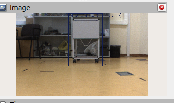

# Using YOLO with the cameras mounted to J100
In this section, I will explain how I installed YOLO to my computer, how I created a dataset for a certain object and finally how I trained and used that custom trained YOLO Model. 

## Setup and Basic Usage

 **The first thing I did was that I installed ultralytics library into clearpath_ws following exactly all the instructions from [here](https://github.com/mgonzs13/yolo_ros) - YOLO for ROS2 Jazzy.  If you encounter errors through this process refer to the official documents**

 Then, I did the following

 - 1: I extend the PYTHONPATH environment variable to include my virtual environment’s site-packages directory so Python can locate and import installed packages from that environment, which is where YOLO and ultralytics are installed.
    ```bash
    export PYTHONPATH=$HOME/clearpath_ws/.venv/lib/python3.12/site-packages:$PYTHONPATH
    ```

- 2: After ensuring the robot’s camera is up and running, I run a ROS2 launch file that starts a pre-trained YOLO model for real-time object detection on the camera stream.

    ```bash
    ros2 launch yolo_bringup yolo.launch.py   input_image_topic:=/j100_0000/sensors/camera_1/color/image   yolo_encoding:=rgb8   threshold:=0.2   device:=cpu
    ```
    **RESULT:**

    

    The result should be exactly the same for a real operational camera.

## Training a yolo model and using it with a real camera 

### Creating the required dataset

 - 1: The first step was to create a standard YOLO dataset. For the train dataset, I collected 130 images in total: 65 containing the target object within the frame and 65 without the target object. For the valid dataset I did exactly the same but with a total of 30 photos.
 - 2: Using tools such as [makesense.ai](https://www.makesense.ai/), I annotated the target object by drawing bounding boxes around them and exported the annotations as YOLO-format text files.
 - 3: Using a python script I made, I generated empty txt files to play the role of labels for the photos that do not contain the target object, that's how yolo understands wether a photo contains the target or not.

    **Each txt file should have exactly the same name with the photo it represents in order everything to work properly**

- 4: I created the [data.yaml](Code_Examples/data.yaml) that the model needs in order to find the train and valid folders and also to know the class of the object that is being detected 

- 5: Finally, I organized the dataset directory in the standard YOLO format so that it could be properly read and used for training.
    ```
    dataset/
    ├── images/
    │   ├── train/
    │   │   ├── img001.jpg
    │   │   ├── img002.jpg
    │   │   └── ...
    │   ├── val/
    │       ├── img101.jpg
    │       ├── img102.jpg
    │       └── ...
    ├── labels/
    │   ├── train/
    │   │   ├── img001.txt
    │   │   ├── img002.txt
    │   │   └── ...
    │   ├── val/
    │       ├── img101.txt
    │       ├── img102.txt
    │       └── ...
    ├── data.yaml
    ```

### Writhing the python code that trains and saves the model

For this part I took advantage of the [google colab notebook](https://colab.research.google.com/) in order to use external GPU, not the one of my computer. 

At each cell I wrote:

- 1: I installed the ultralytics library
    ```bash
    !pip install ultralytics
    ```
- 2: I zipped the dataset directory and then I loaded it to the notebook
    ```bash
    from google.colab import files
    uploaded = files.upload()
    ```
- 3: I set the working directory to the dataset location and loaded a pre-trained YOLO model using the Ultralytics library. Then, I trained the model for 100 epochs using my dataset configuration file with a fixed image size and batch size.

    ```bash
    %cd /content/dataset/dataset/
    from ultralytics import YOLO

    model = YOLO("yolo11n.pt")

    model.train(
        data="data.yaml",
        epochs=100,
        imgsz=640,
        batch=8
    )
    ```
- 4: I used Google Colab’s file download utility to export the trained model weights. Specifically, I downloaded the best-performing model checkpoint (`best.pt`) from the training output directory to my local machine.
    ```bash
    files.download("runs/detect/train/weights/best.pt")
    ```

## Running the yolo node with my custom model

After making sure that the camera is up and running, I run the followwng once:

    ros2 launch yolo_bringup yolo.launch.py   input_image_topic:=/j100_0710/sensors/camera_1/color/image   yolo_encoding:=rgb8   threshold:=0.2   device:=cpu   model:=/home/robolab/best.pt

## Running yolo via the robot's computer

In a terminal type these commands:

```bash
#1
export PYTHONPATH=$HOME/ros2_ws/.venv/lib/python3.12/site-packages:$PYTHONPATH

#2
ros2 launch yolo_bringup yolo.launch.py   input_image_topic:=/j100_0000/sensors/camera_1/color/image   yolo_encoding:=rgb8   threshold:=0.2   device:=cpu

```

### Result:


