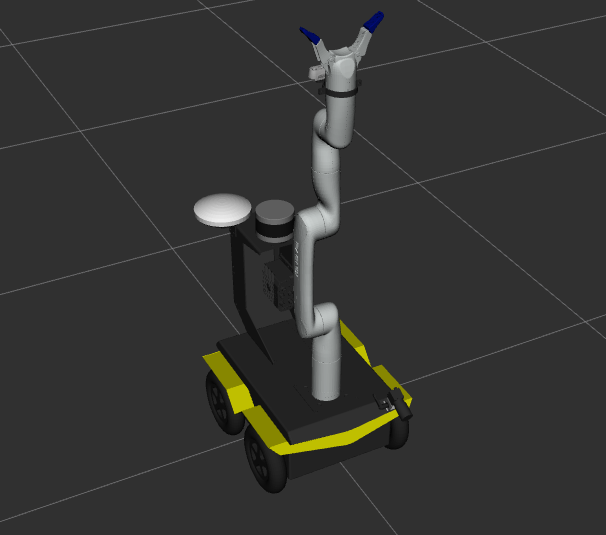

# Offboard Computer Setup with a custom Clearpath Robot

This guide explains how to set up an offboard computer for visualizing and interacting with a custom Clearpath robot using **ROS 2 Jazzy**. 

---

## Set Up the Environment for ROS 2 Jazzy

ROS 2 Jazzy **officially supports Ubuntu 24.04** as the Tier 1 operating system. If you have not installed ROS 2 Jazzy, click [here](https://docs.ros.org/en/jazzy/Installation/Ubuntu-Install-Debs.html) and follow the installation instructions. Then follow the below steps one by one.


- 1: Download the clearpath and clearpath_ws directories from this repository into your home directory. I recommend downloading this repo as a zipfile straight from Github, then extracting and copying only these folders to your home directory. Alternatively, you can clone this repository and move just these two folders to your home directory.
  
  ### Now Open a terminal in your home directory 

- 2: Install Clearpath Packages
```bash
wget https://packages.clearpathrobotics.com/public.key -O - | sudo apt-key add -
sudo sh -c 'echo \
    "deb https://packages.clearpathrobotics.com/stable/ubuntu $(lsb_release -cs) main" > \
    /etc/apt/sources.list.d/clearpath-latest.list'
sudo apt-get update
```
- 3: Update rosdep dependencies with the package built & hosted on Clearpath's servers

```bash
sudo wget \
https://raw.githubusercontent.com/clearpathrobotics/public-rosdistro/master/rosdep/50-clearpath.list \
-O /etc/ros/rosdep/sources.list.d/50-clearpath.list

rosdep update
```
*In case you have an error, just type ```sudo rosdep init``` and then try again step 3.*

- 4: This package will install launch and configuration files for visualising and interacting with the robot
```bash
sudo apt install ros-jazzy-clearpath-desktop
```

- 5: Generate the setup.bash file:
```bash
source /opt/ros/jazzy/setup.bash
ros2 run clearpath_generator_common generate_bash -s ~/clearpath
```


- 6: Installing Gazebo Harmonic and Clearpath SImulator. As usual type the following commands one by one 
 ```bash
sudo apt-get install ros-jazzy-ros-gz
sudo apt-get update
sudo apt-get install ros-jazzy-clearpath-simulator
```
- 7: Type the following commands in order to source the workspace of the robot  
 ```bash
 source /opt/ros/jazzy/setup.bash
 cd clearpath_ws
 colcon build
 source install/setup.bash
 ```
---
## !!Important before simulating: Do the following once. By this way everything will work properly everytime you open a new terminal without having to source ROS2 again and again. 

1: open bashrc by typing 
```bash
nano ~/.bashrc
```
2: go to the bottom of the file and add the following:
```bash
source /opt/ros/jazzy/setup.bash
source ~/clearpath_ws/install/setup.bash
```
3: Press **Ctrl + O** and then press **Enter** in order to save the changes

4: Press Ctrl + X to quit

**Now every time you open the terminal ROS2 is sourced automatically**

## Simulate
**Having done the above, open a new terminal and do the following** 

- 1: Launching the simulator along with rviz. (optional argument) 
 ```bash
ros2 launch clearpath_gz simulation.launch.py rviz:=true
```

- 2: Driving the robot:
Install the teleop_twist_keyboard ROS 2 package:
 ```bash
sudo apt-get update
sudo apt-get install ros-jazzy-teleop-twist-keyboard

```
Once installed run the code: 
 ```bash
ros2 run teleop_twist_keyboard teleop_twist_keyboard --ros-args -p stamped:=true

```

--- 
You need to use the command `ros2 topic list` to find the robot’s name along with `cmd_vel` which is the topic for navigation and then set this topic in Gazebo (the option is at the top right). After that, you will be able to drive it like a remote-controlled robot in the simulator. If this works, it means everything has been set up correctly.

---

- Final Result: 



---

# Important Additional Information 

### Customizing the robot 
If you want to make experiments and customise the robot, you can do it by editing the robot.yaml file inside the clearpath folder. Every time you make a change, after saving you need to type the following commands in order everything to work properly 

```bash
ros2 run clearpath_generator_common generate_bash -s ~/clearpath
source /opt/ros/jazzy/setup.bash
```
If you want to add new meshes, I suggest you to add them in an existing directory that contains meshes. For example ```/clearpath_ws/src/clearpath_common/clearpath_mounts_description/meshes```. After that open a new terminal in clearpath_ws directory and type:
```bash
rm -rf build install log
colcon build
source install/setup.bash
cd ..
```

### Clearpath Docs: 
For detailed information on how everything works, please refer to the [official documentation](https://docs.clearpathrobotics.com/docs/ros/)

### Always build in workspace directories, never src
But if you do it by mistake just go to the folder you did ```colcon build``` by mistake, open the terminal and type:
```bash
rm -rf build install log
```
### Building in the same Workspace multiple times
It is suggested to always do ```rm -rf build install log``` before you type ```colcon build``` in an already built workspace.

