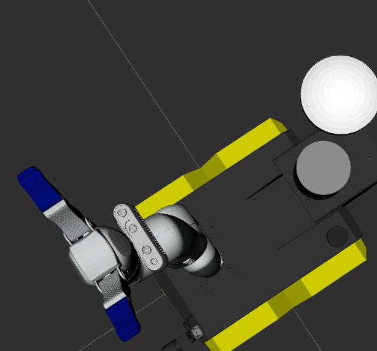
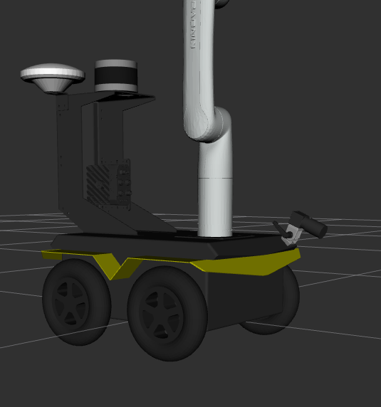
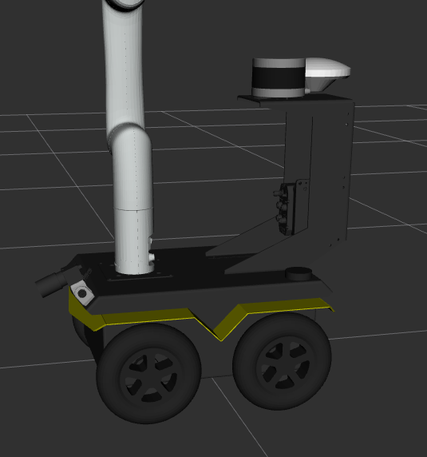

# Offboard Computer Setup with a custom Clearpath Robot

This guide explains how to set up an offboard computer for visualizing and interacting with a custom Clearpath robot using **ROS 2 Jazzy**. 

---

## Operating System

#### ROS 2 Jazzy

- ROS 2 Jazzy **officially supports Ubuntu 24.04** as the Tier 1 operating system.  
- For offboard computers, it is recommended to install **Ubuntu 24.04 Desktop**.  
- Other operating systems are supported, but Ubuntu 24.04 provides the most reliable experience.
- If you have not installed ROS 2 Jazzy, click [here](https://docs.ros.org/en/jazzy/Installation/Ubuntu-Install-Debs.html) and follow the installation instructions.

---

## Set Up the Environment for ROS 2 Jazzy

Just run the following commands in the terminal one by one:

- 1: Install Clearpath Packages
```bash
wget https://packages.clearpathrobotics.com/public.key -O - | sudo apt-key add -
sudo sh -c 'echo \
    "deb https://packages.clearpathrobotics.com/stable/ubuntu $(lsb_release -cs) main" > \
    /etc/apt/sources.list.d/clearpath-latest.list'
sudo apt-get update
```
- 2: Update rosdep dependencies with the package built & hosted on Clearpath's servers

```bash
sudo wget \
https://raw.githubusercontent.com/clearpathrobotics/public-rosdistro/master/rosdep/50-clearpath.list \
-O /etc/ros/rosdep/sources.list.d/50-clearpath.list

rosdep update
```
- 3: This package will install launch and configuration files for visualising and interacting with the robot
```bash
sudo apt install ros-jazzy-clearpath-desktop
```

- 4: Download clearpath and clearpath_ws folders from this repository and place it in your home directory, then type the following commands:
```bash
source /opt/ros/jazzy/setup.bash
ros2 run clearpath_generator_common generate_bash -s ~/clearpath
```


- 5: Installing Gazebo Harmonic and Clearpath SImulator. As usual type the following commands one by one 
 ```bash
sudo apt-get install ros-jazzy-ros-gz
sudo apt-get update
sudo apt-get install ros-jazzy-clearpath-simulator
```
- 6: Type the following commands in order to source the workspace of the robot  
 ```bash
 source /opt/ros/jazzy/setup.bash
 cd clearpath_ws
 colcon build
 source install/setup.bash
 ```
---
## !!Important before simulating: Do the following once. By this way everything will work properly everytime you open the terminal without having to source ROS2 again and again. 

1: open bashrc by typing 
```bash
nano ~/.bashrc
```
2: go to the bottom of the file and add the following:
```bash
source /opt/ros/jazzy/setup.bash
source ~/clearpath_ws/install/setup.bash
```
3: Press **Ctrl + O** and then press **Enter** in order to save the changes

4: Press Ctrl + X to quit

**Now every time you open the terminal ROS2 is sourced automatically**

## Simulate
**Having done the above, open a new terminal and do the following** 

- 1: Launching the simulator along with rviz. (optional argument) 
 ```bash
ros2 launch clearpath_gz simulation.launch.py rviz:=true
```

- 2: Driving the robot:
Install the teleop_twist_keyboard ROS 2 package on the robot computer or on an offboard computer:
 ```bash
sudo apt-get update
sudo apt-get install ros-jazzy-teleop-twist-keyboard

```
Once installed run the code: 
 ```bash
ros2 run teleop_twist_keyboard teleop_twist_keyboard --ros-args -p stamped:=true

```

--- 
You need to use the command `ros2 topic list` to find the robot’s name along with `cmd_vel`, the topic for navigation and set this topic in Gazebo (the option is at the top right). After that, you will be able to drive it like a remote-controlled robot in the simulator. If this works, it means everything has been set up correctly.

---

- Final Result: 




---

# Bonus 
If you want to make experiments and customise the robot, you can do it by editing the robot.yaml file inside the clearpath folder. Every time you make a change, after saving you need to type the following commands in order everything to work properly 

```bash
ros2 run clearpath_generator_common generate_bash -s ~/clearpath
source /opt/ros/jazzy/setup.bash

```

