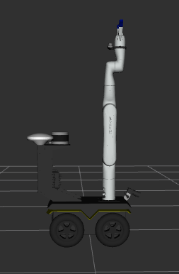
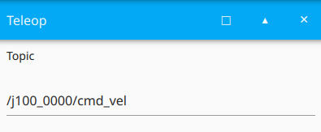
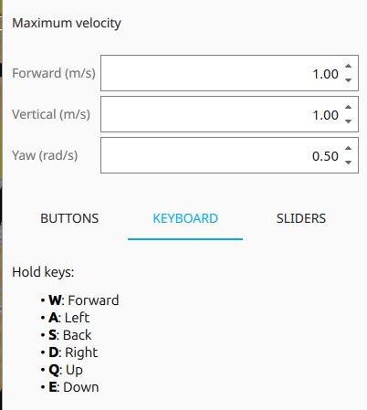
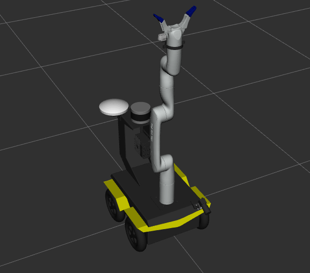

# Offboard Computer Setup with a custom Clearpath Robot

This guide explains how to set up an offboard computer for visualizing and interacting with a custom Clearpath robot using **ROS 2 Jazzy**. 

<div align="center">
  
</div>


## Set Up the Environment for ROS 2 Jazzy

ROS 2 Jazzy **officially supports Ubuntu 24.04** as the Tier 1 operating system. If you have not installed ROS 2 Jazzy, click [here](https://docs.ros.org/en/jazzy/Installation/Ubuntu-Install-Debs.html) and follow the installation instructions. Then follow the below steps one by one.


- 1: Download the clearpath and clearpath_ws directories from this repository into your home directory. I recommend downloading this repo as a zipfile straight from Github, then extracting and copying only these folders to your home directory. Alternatively, you can clone this repository and move just these two folders to your home directory.
  
  ### Now Open a terminal in your home directory 

- 2: Install Clearpath Packages
  >  **IMPORTANT**: SUDO COMMANDS WILL ASK FOR YOUR PASSWORD IN ORDER TO PROCEED
  ```bash
  wget https://packages.clearpathrobotics.com/public.key -O - | sudo apt-key add -
  sudo sh -c 'echo \
      "deb https://packages.clearpathrobotics.com/stable/ubuntu $(lsb_release -cs) main" > \
      /etc/apt/sources.list.d/clearpath-latest.list'
  sudo apt-get update
  ```
- 3: Update rosdep dependencies with the package built & hosted on Clearpath's servers

  ```bash
  sudo wget \
  https://raw.githubusercontent.com/clearpathrobotics/public-rosdistro/master/rosdep/50-clearpath.list \
  -O /etc/ros/rosdep/sources.list.d/50-clearpath.list

  rosdep update
  ```
  *In case you have an error, just type ```sudo rosdep init``` and then try again step 3.*

- 4: This package will install launch and configuration files for visualising and interacting with the robot
  ```bash
  sudo apt install ros-jazzy-clearpath-desktop
  ```

- 5: Generate the setup.bash file:
  ```bash
  source /opt/ros/jazzy/setup.bash
  ros2 run clearpath_generator_common generate_bash -s ~/clearpath
  ```


- 6: Installing Gazebo Harmonic and Clearpath SImulator. As usual type the following commands one by one 
  ```bash
  sudo apt-get install ros-jazzy-ros-gz
  sudo apt-get update
  sudo apt-get install ros-jazzy-clearpath-simulator
  ```
- 7: Type the following commands in order to source the workspace of the robot  
  ```bash
  source /opt/ros/jazzy/setup.bash
  cd clearpath_ws
  colcon build
  source install/setup.bash
  ```
---
## !! Important before simulating: Do the following once. By this way everything will work properly everytime you open a new terminal without having to source ROS2 again and again. 

- 1: open bashrc by typing 
  ```bash
  nano ~/.bashrc
  ```
- 2: go to the bottom of the file and add the following:
  ```bash
  source /opt/ros/jazzy/setup.bash
  source ~/clearpath_ws/install/setup.bash
  ```
- 3: Press **Ctrl + O** and then press **Enter** in order to save the changes

- 4: Press Ctrl + X to quit

  **Now every time you open the terminal ROS2 is sourced automatically**

## Simulate
> IF YOU ARE USING UBUNTU IN AN EMULATOR AND NOT NATIVELY, GO TO [Setup Lighter  Gazebo World Guide](./Custom_Jackal_J100_Tutorials/Lighter_Simulation.md) and follow the instructions. Once you finished, return here.
> 
**Having done the above, open a new terminal and do the following** 

- 1: Launching the simulator along with rviz. (optional argument) 
  ```bash
  # Use this command if you are using Ubuntu Natively.
  ros2 launch clearpath_gz simulation.launch.py rviz:=true

  # Use this command if you completed the Lighter Gazebo Simulation Guide
  ros2 launch clearpath_gz cse_simulation.launch.py rviz:=true world:=empty
  ```

- 2: Driving the robot:

  #### After setting up, You can immediately  drive the robot.

  Just copy and paste ```/j100_0000/cmd_vel``` into the top-right corner of the Gazebo simulation under the “Topics” section. 
    
    


    Now you can drive the robot either with buttons or your keyboard

    

---

## How the Robot must look like in your Simulation: 

<div align="center">
  
</div>

# Custom Jackal J100 Tutorials contents

| # | Topic                  | Description                                                                 | Notes                               |
|---|--------------------------------|-----------------------------------------------------------------------------|-------------------------------------|
| ● | Important Additional Information | In this section I have included various tips and additional information that may make your workflow easier and more efficient. | See [folder](Custom_Jackal_J100_Tutorials/Important_Additional_Information.md) for full code and execution examples. |
| ● | Autonomous Driving with Nav2| Setting up Nav2 for mapping and autonomous navigation. | See [folder](/Custom_Jackal_J100_Tutorials/Autonomous_Driving_With_Nav2.md) for full code & examples |
| ● | FLir Camera with YOLO | In this section I describe how to integrate YOLO with the J100’s cameras by connecting it to the FLIR image topic. I also provide the required commands. | See [folder](Custom_Jackal_J100_Tutorials/J100_YOLO.md) for full code and execution examples |
| ● | Lighter Gazebo Environment | In this section I explain how to set up a lighter Gazebo simulation environment by replacing default files and optionally simplifying the robot configuration.  | See [folder](/Custom_Jackal_J100_Tutorials/Lighter_Simulation.md) for full code and execution examples |
| ● | Kinova Manipulator | Ι explain how to control the Kinova Gen3 Lite manipulator in simulation using ROS 2 topics, actions, and MoveIt. It includes step-by-step commands for controlling joints and the gripper, as well as planning and executing motions in RViz.  | See [folder](/Custom_Jackal_J100_Tutorials/Manipulation.md) for full code and execution examples |
| ● | Saving Disk Image | In this section I describe how to create a full disk image of the robot for backup and how to safely restore it using a live USB.| See [folder](/Custom_Jackal_J100_Tutorials/Saving_disk_image.md) for full code and execution examples |
| ● | Driving Jackal via `cmd_vel` | In this section I explain how to control the Jackal robot by publishing velocity commands to the `/j100_0000/cmd_vel` topic. | See [folder](/Custom_Jackal_J100_Tutorials/Driving_Jackal.md) for full code and execution examples. |
| ● | Connecting to and Controlling the actual robot| In this section I explain how to connect and control the actual robot | See [folder](/Custom_Jackal_J100_Tutorials/Connecting_and_Managing_the_Robot.md) for full code and execution examples. |
